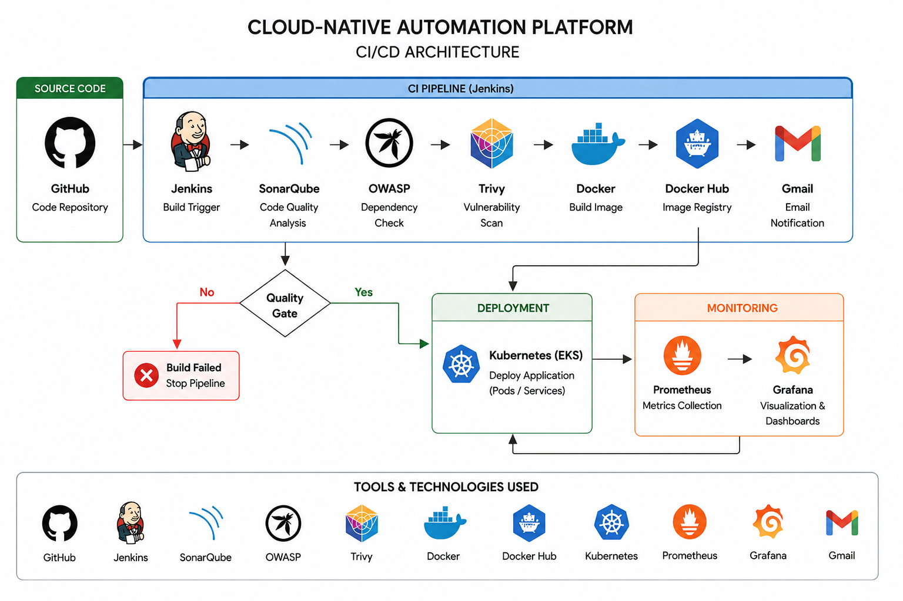
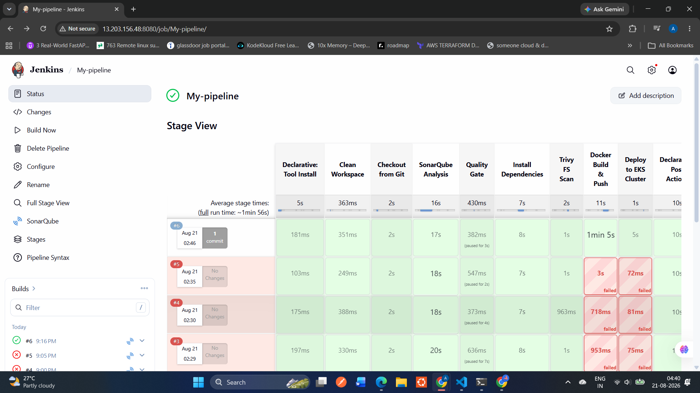
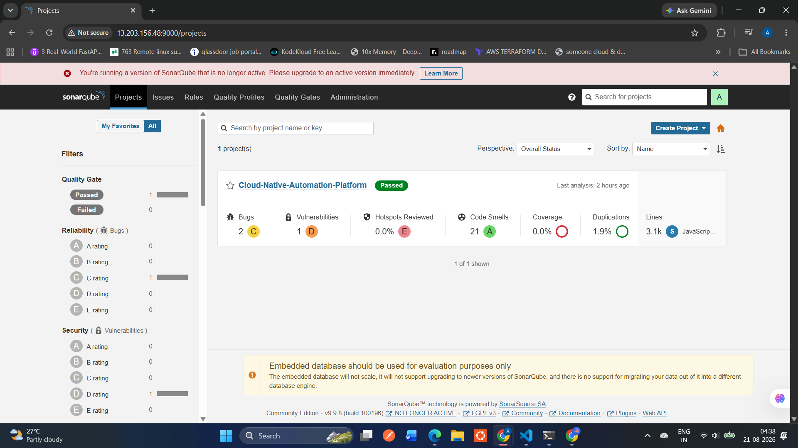
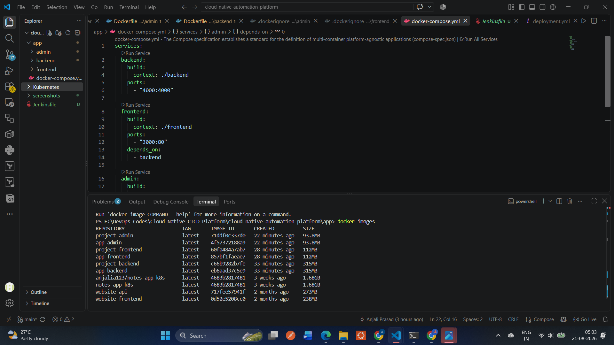
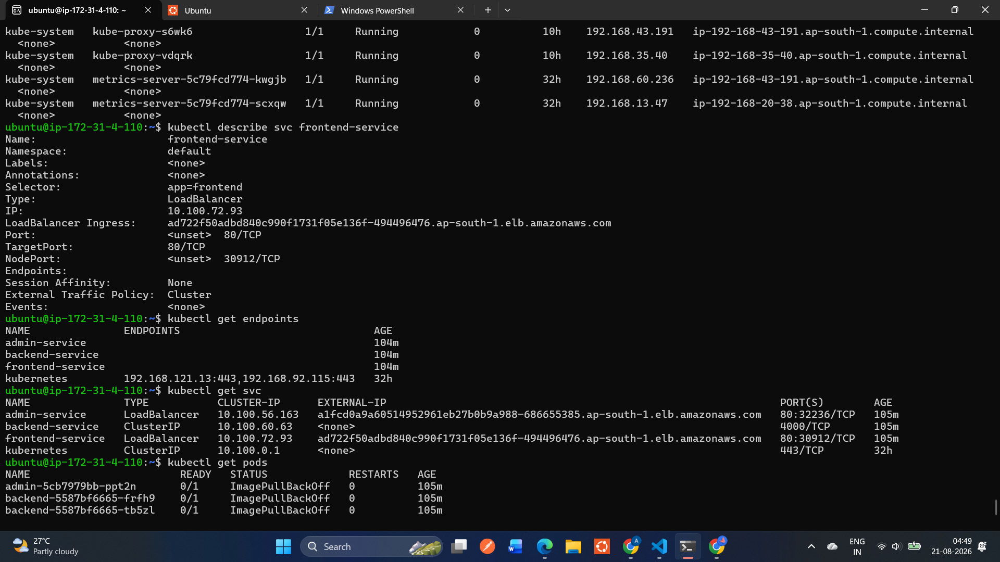
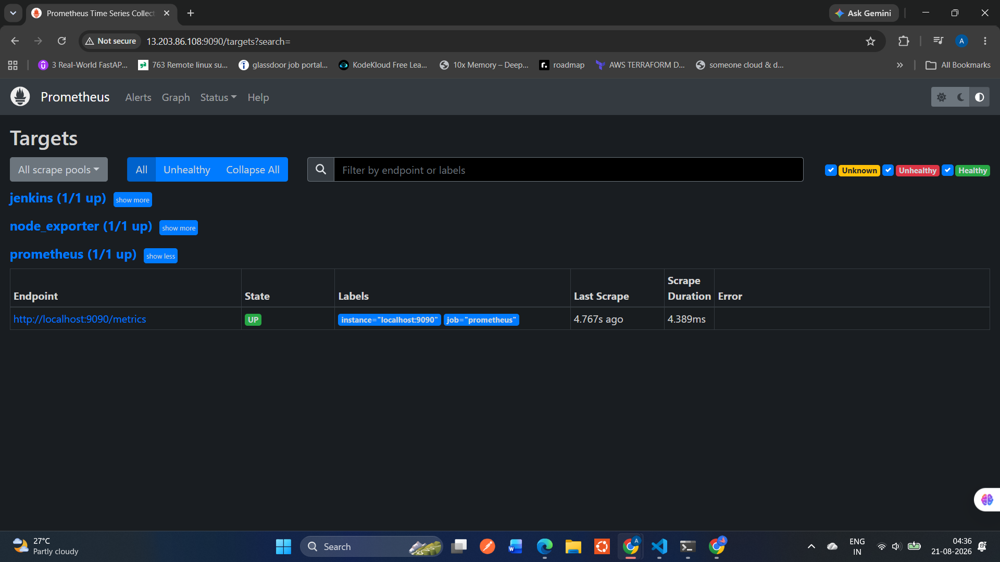
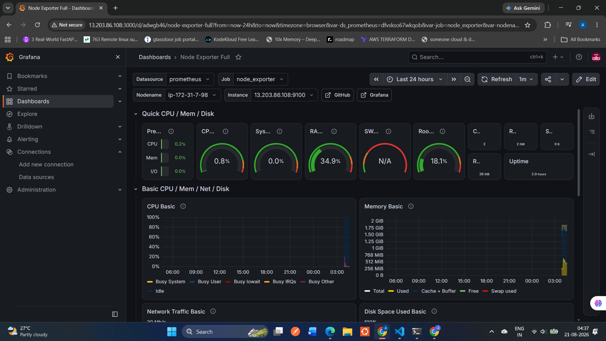

# 🚀 Cloud-Native Automation Platform

## 📌 About The Project

This project demonstrates a complete **Cloud and DevOps workflow** for deploying an existing full-stack application.

Instead of building the application from scratch, I randomly selected an existing project from GitHub and focused on the responsibilities of a **Cloud/DevOps Engineer**.

The goal was to take the application through the complete lifecycle:

- Understand the application structure
- Containerize the frontend, backend, and admin services
- Build a CI/CD pipeline
- Perform code quality and security scans
- Build and push Docker images
- Deploy the application using Kubernetes
- Monitor the infrastructure using Prometheus and Grafana

---

# 🏗️ Architecture



The complete workflow:

```text
GitHub
   ↓
Jenkins CI/CD Pipeline
   ↓
SonarQube → OWASP Dependency Check → Trivy
   ↓
Quality Gate
   ↓
Docker Build
   ↓
Docker Hub
   ↓
Kubernetes Deployment
   ↓
Prometheus
   ↓
Grafana


If the Quality Gate fails, the pipeline stops. If successful, the application continues to the deployment stage.

---

# 🛠️ Technologies Used

| Tool                   | Purpose                  |
| ---------------------- | ------------------------ |
| GitHub                 | Source Code Management   |
| Jenkins                | CI/CD Pipeline           |
| SonarQube              | Code Quality Analysis    |
| OWASP Dependency Check | Dependency Security Scan |
| Trivy                  | Vulnerability Scanning   |
| Docker                 | Containerization         |
| Docker Hub             | Image Registry           |
| Kubernetes             | Container Orchestration  |
| AWS                    | Cloud Infrastructure     |
| Prometheus             | Metrics Collection       |
| Grafana                | Monitoring & Dashboards  |
| Gmail                  | Pipeline Notifications   |

---

# 🐳 Application Containerization

The application contains three services:

```text
Frontend
Backend
Admin Panel
```

Each service has its own Dockerfile because they have different dependencies and runtime configurations.

Docker images:

```text
anjalia123/project-backend:latest
anjalia123/project-frontend:latest
anjalia123/project-admin:latest
```

These images are pushed to Docker Hub and used for Kubernetes deployment.

---

# ⚙️ CI/CD Pipeline

The Jenkins pipeline performs the following stages:

```text
1. Clean Workspace
2. Checkout Source Code
3. SonarQube Analysis
4. Quality Gate
5. Install Dependencies
6. OWASP Dependency Scan
7. Trivy Filesystem Scan
8. Docker Build
9. Docker Push
10. Kubernetes Deployment
11. Email Notification
```

---

# ☸️ Deployment

The Dockerized application is deployed using Kubernetes.

Kubernetes manages:

* Deployments
* Pods
* Services

```text
Docker Hub
    ↓
Kubernetes
    ├── Backend
    ├── Frontend
    └── Admin
```

---

# 📊 Monitoring

The infrastructure is monitored using:

**Prometheus** — Collects server and application metrics.

**Node Exporter** — Exposes system metrics such as CPU, memory, and disk usage.

**Grafana** — Visualizes the metrics using dashboards.

```text
Server
   ↓
Node Exporter
   ↓
Prometheus
   ↓
Grafana
```

---

# 📸 Project Screenshots

## Jenkins Pipeline



## SonarQube Analysis



## Docker Images



## Kubernetes Deployment



## Prometheus



## Grafana Dashboard




---

# 🎯 What I Learned

Through this project, I gained hands-on experience with:

* Jenkins CI/CD
* SonarQube integration
* OWASP Dependency Check
* Trivy vulnerability scanning
* Docker and Docker Hub
* Multi-service containerization
* Kubernetes deployments and services
* AWS infrastructure
* Prometheus and Node Exporter
* Grafana monitoring
* End-to-end CI/CD automation

---

## 👩‍💻 Author

**Anjali Kumari Prasad**
Aspiring Cloud & DevOps Engineer

GitHub: [AnjaliKumariPrasad](https://github.com/AnjaliKumariPrasad?utm_source=chatgpt.com)

```

This version is **short enough for recruiters to read**, but still clearly shows that you took an existing application and built the **complete DevOps lifecycle around it**. 
```
